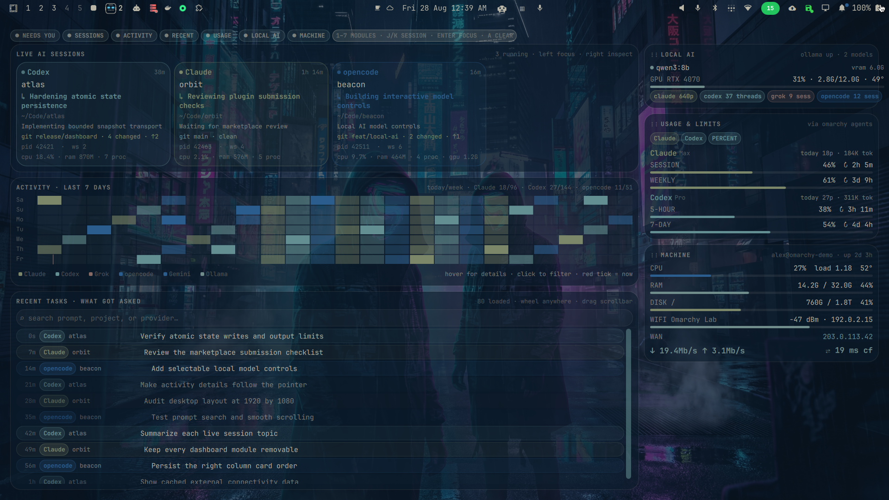

<h1 align="center">Infomarchy</h1>

<p align="center">
  <b>Your wallpaper, promoted to information desk.</b><br>
  Every AI agent running on your machine, what it's doing, what it cost you, and how the box is holding up —<br>
  drawn live on the Omarchy desktop in your current theme, one glance away, one click to jump in.
</p>

<p align="center">
  <a href="https://omarchy.org"></a>
  
  
  
  <a href="LICENSE"></a>
</p>

<p align="center">
  
</p>

The public preview is the real plugin rendered on an empty Omarchy desktop using Infomarchy's explicit, transient demo-data mode. It contains no live prompt, hostname, username, network, path, process, or session data.

> **Want to see the plain desktop?** Press **`SUPER + I`** to hide the Infomarchy cards and reveal your wallpaper. Press **`SUPER + I`** again to bring the dashboard back. Add the one-time key binding shown under [Install](#install).

---

## Why

You run Claude Code in three terminals, Codex in a fourth, Grok is poking at a repo somewhere, Ollama is warming a model, and your weekly limit is quietly at 86%. The only way to know any of that is to go *look* — tab through windows, read titles, run `nvidia-smi`, open a dashboard.

Infomarchy puts all of it on the one surface you always have open and never use: **the wallpaper.** It's not a widget in the bar and not another window to manage. It's the desk itself, and it's always current.

## What you get

<table>
<tr>
<td width="62%" valign="top">

### 🟡 Live AI sessions — *who is working right now*


One card per running agent — **Claude Code, Codex, Grok, Grok Bot, Gemini, Hermes, opencode, aider, Ollama chats** — detected straight from `/proc`, no agent-side hooks, nothing to configure. Each card shows the project, working directory, how long it's been up, the pid, the workspace it lives on, and the terminal's own title. Its two-line **current topic** is a short synopsis derived from several exact-session requests—not the last prompt copied onto the card. A loaded local Ollama model may refine the wording; summaries are cached by session/content and Infomarchy never auto-loads a model. The dot **pulses while the agent is thinking**.

**Zombies.** A session nobody is attached to (background, or no window and nothing to attach to) that is not busy and has had no prompt for six hours gets a **STALE · idle Nh** tag on its card. Right-click it: a background Claude session offers **STOP SESSION** (`claude stop <id>` — graceful, the conversation stays resumable), anything else stale offers **END PROCESS** (SIGTERM, only after the helper re-verifies the pid still belongs to the process the card described). Both need a second confirming click within four seconds; nothing is ever stopped automatically. Claude Code's own registry (`claude agents --json`, consulted only when its daemon is already running) supplies exact session ids, display names and live busy/blocked state for every running Claude, and marks **background** sessions — the ones started with `--bg` or living under the daemon — whose cards open a terminal attached to the running session (`claude attach <id>`). Agents hosted inside **Herdr, Boomux, or tmux** remain visible. Their large session card reports the host and its bounded identity: Herdr workspace/tab/pane, Boomux workspace/shell plus exact shell/run IDs in the snapshot, or tmux `session:window.pane`. Infomarchy reads only those documented identity variables from the agent environment; unrelated environment values are never serialized. An attached tmux pane is matched to its client terminal, and a Herdr-hosted agent to the terminal running the Herdr client (the agent descends from `herdr server`, a daemon, so plain process ancestry never reaches the window). **Clicking the card focuses that terminal and then jumps inside the multiplexer**: `tmux select-window` / `select-pane` / `switch-client` for tmux, `workspace.focus` / `tab.focus` / `pane.focus` over Herdr's socket API for Herdr (its CLI only exposes a *directional* pane focus), via the bundled `herdr-focus.ts`, each id validated and the socket taken from the agent's own environment. For Boomux the window is matched through the `boomux __attach <shell-id>` client process, or the terminal title Boomux sets (`boomux:shell:<node>:<shell-id> | workspace - name`); the jump focuses that window and runs `boomux open <shell-id> --workspace <workspace-name>`, which shows the Workspace layer and re-focuses the existing terminal (verified against Boomux 1.9.7: no duplicate window; a bare `open` neither moves focus nor duplicates). A shell created from inside Herdr inherits Herdr's variables, so Boomux is resolved first and the inherited Herdr host is dropped. A host with no client window at all shows **no client window found** rather than guessing one. Remote-only processes on another machine are outside local `/proc` and are not fabricated.

**Grok Bot.** The xAI desktop app runs every bot in its roster inside one Electron process, so `/proc` shows a single agent no matter how many bots you have. Infomarchy reads the app's own local roster — `~/.config/Grok Bot/sand-client-persistence`, one plain-JSON file per state slice, each named by the base32 of its key — and gives **each bot its own card**: its name, the last line it wrote (markdown flattened, secrets redacted like any other prompt), and whether it is waiting on your answer or holding replies you have not read. Bots you hid from the sidebar get no card, and transcripts are never opened. Since the bots share one process, its CPU/RAM/GPU counters are attributed once, to the bot the app currently has open; the other cards show `—` rather than repeating the same process on every card. Clicking any of them focuses the Grok Bot window.

Each card also attributes live CPU, resident RAM, process-tree size, and—when `nvidia-smi` exposes compute PIDs—GPU memory to that agent. The detailed totals repeat in the inspector; unavailable counters display `—`.

Only the full per-session cards appear in Live AI Sessions; there is no duplicate compact workspace-card strip. Each large card includes its workspace number. In the session inspector, workspace buttons 1–10 can move that exact agent window silently; the current workspace is highlighted and disabled.

Window thumbnails are opt-in: right-click a large session card, toggle **PREVIEWS OFF/ON** in its inspector, then hover a live card. Infomarchy captures only that exact address after a short delay, downsizes it to 160×90, applies a heavy blur, and displays a 320×180 still. The raw capture moves through bounded in-memory streams from `grim` to ImageMagick without touching disk; the blurred result is written through an exclusive no-follow descriptor inside a random private temporary directory.

Cards also show the repository branch, clean/changed state, ahead/behind counts, and merge conflicts. A **Needs You** strip calls out agents that appear blocked, waiting for input, or finished for review, plus repositories being shared by multiple live agents.

Active Needs You signals get a faint breathing outline (the module chip glows too if the card is removed). Click the signal to focus it, **10M** to snooze it for ten minutes, or **×** to dismiss that signal for the lifetime of its process. Snoozes and dismissals persist between the wallpaper and fullscreen overlay.

The card's alert controls send deduplicated Omarchy notifications when an agent is blocked, waiting for an answer, ready for review, or ends — and, when the terminal title says so, when it has crashed (Infomarchy reads titles and `/proc`; it has no exit-status feed, so a silent segfault reports as an ended session). A signal that clears and later fires again is a new episode and notifies again. Alerts are enabled globally by default; each currently active provider can be muted independently, and **QUIET 22–08** suppresses overnight delivery. Event fingerprints persist for seven days, so restarting the shell never replays old alerts. A disappeared session must be absent from two consecutive polls before Infomarchy reports that it ended. Clicking an alert opens the fullscreen desk.

**Click a Needs You signal → jump straight to that agent's terminal.** From the fullscreen overlay, Infomarchy closes itself after focusing the session.

**Click a card → Infomarchy focuses the terminal window hosting that agent.** It walks the process tree up to the Hyprland client, so it works through `kitty`, `alacritty`, `ghostty`, tmux, whatever.

**Right-click a card → inspect it in place.** The centered inspector shows its window, shortened session identity, workspace, uptime, pid, and repository state. From there you can focus the existing window or open a fresh terminal in the project directory; paths are passed as process arguments, never evaluated as shell text.

</td>
<td width="38%" valign="top">

### 🟢 Usage & limits — *what it's costing you*


Above the limit meters sits a **7-day trend**: one line per provider, tokens processed per day, three gridlines, hover any day for the exact figures. The **TOKENS / ≈ $ VALUE** chip switches the same lines to an *estimated API value* — what those tokens would have cost at published API prices — and each provider row shows today's and lifetime estimates, the share of lifetime tokens that were cache reads, and the session count. Prices come from a pinned, attributed LiteLLM snapshot (`pricing.json`, see `THIRD_PARTY_NOTICES.md`); models missing from it are shown as *unpriced* rather than guessed, and the estimate is never your subscription bill. All of it is read from the `omarchy.agents` usage cache — no new scanning.

Session (5-hour) and weekly (7-day) rate-limit meters with time-to-reset, today's prompt count and token volume, per subscription. Meters turn **yellow past 60%** and **red past 85%**, in your theme's yellow and red.

Provider chips filter the card interactively. Toggle **PERCENT / FORECAST** to project each recognized 5-hour or 7-day meter to reset from its elapsed-window pace; young or malformed windows say `learning` instead of showing a misleading number.

Infomarchy reuses the cache that Omarchy's own `omarchy.agents` bar widget maintains — enable that widget once and this card lights up. No extra logins, no API keys.

### 🟢 Local AI

Ollama up/down, every **loaded** model with its VRAM, GPU utilisation / memory / temperature, and lifetime totals per provider. Arrow controls select any locally installed model and show its parameter count, quantization, and disk size. **LOAD** pins the selected model in memory; each loaded row has its own **UNLOAD** action. Models at least 8 GiB—or larger than currently available accelerator/system memory—require a second **CONFIRM** click.

Model changes go through a bounded stdin-framed helper. It validates the model name against Ollama's live `/api/tags` or `/api/ps` inventory before using the documented empty `/api/generate` request with `keep_alive: -1` (load) or `0` (unload). Infomarchy never pulls, deletes, or auto-loads a model.

</td>
</tr>
</table>

### 🟡 Activity · last 7 days — *when you actually work*


An hour-by-hour heatmap of prompts across **every** provider, newest day at the bottom, with a red tick at *now*. The dominant provider colours each cell; intensity is volume. Cells are local wall-clock hours, so on the two DST nights a year one hour is doubled up (fall) or absent (spring). Hover a cell for the exact breakdown (*"Tue 18 Aug 16:00 · 8 prompts (Claude 6, Codex 2)"*). Click an hour to filter Recent Tasks to that hour; click a provider in the legend to combine a provider filter. The selected cell and provider stay outlined, and clicking either again—or **clear**—removes that part of the filter. The header carries today/week counts per provider.

### 🟢 GitHub · last 7 days — *what actually landed*

The right half of the same row is the identical grid fed from GitHub: **commits, PRs, reviews, issues, comments** and everything else (releases, forks, stars, branch creates) as *other*, each cell coloured by its dominant kind, the same red tick at *now*. Hover a cell for the breakdown plus the repositories involved (*"Fri 4 Sep 23:00 · 9 events · commits 7 · PRs 2 · infomarchy, blip"*). The header carries today/week counts per kind. There is no list to filter here, so a click **pins** a cell (its breakdown stays in the status line) and clicking a kind in the legend recolours the grid to that kind alone; **clear** or the overlay's **A** key resets both. In the overlay the module answers to key **4** (ACTIVITY is 3; the modules after it shift by one and **0** reaches the tenth).

Data comes through the already-authenticated GitHub CLI (`gh`), nothing else: commits from `search/commits` by author date (one row per commit, default branches only — a push to a feature branch shows once it lands), everything else from your own events feed, private repositories included. GitHub caps a search at 1000 rows and 30 calls a minute, so the week is filled in incrementally — one step a minute until the oldest day is covered (the status line says *filling in older days* meanwhile), then a five-minute refresh. Rows are cached in a private state file written by the wallpaper collector and read by the overlay, so a restart or a dropped connection shows the cached grid rather than an empty card — marked *stale* once fetches have been failing for fifteen minutes, with retries backing off to five minutes. Every six hours the week is walked again so a commit merged days after it was authored still lands in its hour. Switching `gh` accounts starts the store over. Without `gh`, or before `gh auth login`, the card says exactly that. `INFOMARCHY_SKIP_GITHUB=1` in the collector's environment disables the fetch entirely. Remove either card from the module strip and the other takes the full row.

### ⚪ Recent tasks — *what got asked*

The newest prompts across all providers — time ago, provider tag, project, and the prompt itself — so the question *"what was I doing an hour ago?"* has an answer on the wall. The list keeps up to 80 rows in a scrollable history, with a search box that matches prompt text, project, or provider (filtered searches can show up to 200 matches). Prompts whose exact agent session is still running stay bright and clickable; click one to jump to its terminal. Supported closed sessions are dimmed but remain interactive: hover for **RESUME**, then click to reopen that exact Claude, Codex, Grok, or OpenCode session in a terminal at its project directory.

Right-click a prompt for its action drawer: copy, pin/unpin, open the project, and review up to five recent prompts from the same session. Pins persist and sort above ordinary recency without changing the underlying history. Wheel and touchpad deltas are handled directly by the row beneath the pointer, and the wider scrollbar track can be clicked or dragged.

### 🔵 Operations intelligence — *what changed, what needs you, what is healthy*

Three compact cards sit beneath the live sessions:

- **What Changed** fingerprints each active repository and highlights it until you inspect the newest state. It summarizes staged, untracked, test, addition/deletion, and commit data; expand a row to copy changed paths or open the project.
- **Next Actions** turns terminal state into a short reason and an exact control: **Answer**, **Resolve**, **Review**, **Resume**, or **Open Project**. Permission/approval prompts, conflicts, failures, questions, and completed work no longer share one vague warning.
- **Project Health** combines live agent count, branch, clean/dirty state, ahead/behind and conflicts, the last commit, and the newest GitHub Actions result when authenticated `gh` is available. Click a repository to filter sessions, prompts, changes, and action signals across the whole dashboard; click the project chip at the top to clear it.

All three cards are independently removable. Drag their headers left or right to reorder them; they snap into place and the order persists. The layout compacts automatically when one or two cards are hidden.

### 🟢🟡🔵 Machine — *the boring numbers, in the corner where they belong*


| Meter | Colour | Detail |
|---|---|---|
| **CPU** | theme blue | % busy, 1-min load, hottest thermal zone |
| **RAM** | theme **green** | used / total, % |
| **Disk** | theme **yellow** | used / total per mount (btrfs subvolume twins collapsed) |
| **Wi-Fi** | theme **green** | SSID, signal in dBm (bar = link quality), IPv4 |
| **WAN** | theme cyan | cached external IPv4/IPv6 |
| **↓ ↑ throughput** | green | **real-time** bits/s (Kb/Mb/Gb) on the default route interface, wired or wireless |
| **⇄ latency** | green / yellow / red | live **ping to Cloudflare 1.1.1.1** — red on timeout |
| **Battery** | — | % and charging state, hidden on desktops |

Any meter goes **red** when it's genuinely in trouble (RAM > 90%, disk > 90%, CPU > 85%, ping dead).

The three right-column cards—Usage, Local AI, and Machine—also have draggable headers. Drag one far enough up or down to swap it with its neighbor; the card snaps into place and the order persists across overlay and shell restarts. Every section can still be removed and restored from the module strip.

### ⌨️ Two surfaces, one dashboard

The wallpaper is interactive wherever no window covers it (double-click or right-click the empty desk opens Omarchy's wallpaper switcher, as stock does). Press **`SUPER + I`** to hide the wallpaper dashboard and see the clean desktop; press it again to restore the cards. When you're buried in terminals, **`SUPER + D`** shows the desktop on top of everything — the wallpaper exactly as the desk paints it, with the dashboard when SUPER+I has it visible and the plain photo when it doesn't; `Esc` or a click on the backdrop dismisses it.

The module strip doubles as a keyboard command strip in the overlay: **1–9** toggle modules, **J/K** (or arrows) select a live session, **Enter** focuses it, **A** clears activity filters, and **Esc** closes. The selected session gets a bright outline.

## Web Mode

Web Mode makes the Infomarchy desk available in a browser on your phone, tablet, or another computer. It runs with the desktop plugin, so the computer and Omarchy shell must stay running. Open **SETTINGS** from the desk's module strip to manage access.

The page follows the live Omarchy theme and wallpaper. Wide screens use two columns; narrow screens stack cards and offer **UP/DOWN** ordering. Module chips show or hide sections, and zoom is remembered for the current browser tab. Web section visibility and narrow-screen order are independent of the desktop layout but shared by web viewers. A successful refresh updates the page and theme every five seconds while preserving scroll position.

Web Mode displays sessions, recent tasks, activity, usage, local AI status, and machine telemetry. USAGE includes per-model meters and **TOKENS · 7 days**, with unavailable token counts omitted. MEDIA CONTROLS and the $ VALUE chart are absent. Browser controls change presentation; desktop actions such as focusing sessions and loading models remain on the desktop.

### Access and viewer credentials

| Mode | Reachability | Transport | Default port |
| --- | --- | --- | --- |
| **LAN HTTP** | Trusted local IPv4 network; loopback/RFC1918 sources or explicitly allowed CIDRs | Dashboard data and viewer credentials travel unencrypted | 8787 |
| **PRIVATE HTTPS** | Connected Tailscale devices permitted by your tailnet policy | HTTPS through Tailscale Serve to a loopback backend | 8788 |
| **MANUAL HTTPS** | A configured private IPv4 interface or loopback, with the source allow list | Direct HTTPS using your existing certificate and private key | 8789 |

The modes are mutually exclusive. Selecting a different mode turns WEB off; enable it again after reviewing the new setup. Private HTTPS supports viewing away from home through Tailscale. Public internet exposure and Funnel are outside the supported setup.

Each viewer link contains a bearer token: someone with the link and network access can use it. **COPY URL** and **SHOW QR** deliberately reveal the selected token's address only after the listener is ready. Routine startup and status checks do not print token links. Keep links and QR images out of public screenshots, logs, commits, and chat. Tokens are individually revocable; turning WEB off stops access but keeps them for the next start.

### Privacy follows the desktop

The browser shows **PRIVACY ON/OFF · controlled on desktop**. Use the desktop privacy chip or **SUPER+SHIFT+I** to change it: one press enables privacy; three presses within two seconds disable it. Missing, unreadable, or malformed settings default to privacy on.

With privacy on, the server omits WAN/LAN addresses, Wi-Fi SSID, and user/host identity, shortens home mounts, and sends recent prompts only through their first four words plus the mask. Full values are absent from the HTML and JSON, including hidden elements. Session topics, project names, and prompts of four words or fewer stay visible. GitHub login remains excluded at either setting. The JSON view also excludes desktop action arguments, session working directories, previews, and extra provider fields.

Turning desktop privacy off lets connected viewers receive the permitted full values. Changes apply to subsequent responses, normally at the next successful five-second refresh; previously received or saved data cannot be retracted, and a disconnected page can retain its old content. Privacy does not encrypt LAN HTTP traffic. Desktop source data and full-text **COPY EXCERPT** are preserved.

## Set up Web Mode

Install and enable Infomarchy first using [Install](#install). Open the desk with **SUPER+D**, then **SETTINGS**. Choose the desktop privacy setting you want before sharing a viewer link.

Web helpers require Bun, `flock` (util-linux) and `timeout` (coreutils). **SHOW QR** uses `qrencode`; **COPY URL** uses `wl-copy` from `wl-clipboard`. On Omarchy/Arch, install the optional viewer tools with `sudo pacman -S --needed qrencode wl-clipboard`. Tailscale process cleanup requires Python 3; the optional CA recipe requires OpenSSL, and its download helper uses Python 3.

### LAN HTTP: on your trusted local network

1. Connect the desktop and viewing device to a local network you control and trust. Guest Wi-Fi or client isolation can prevent devices from reaching one another.
2. Select **LAN HTTP** in settings. Click **WEB OFF** to start the listener and wait for **WEB ON**.
3. If your desktop firewall blocks incoming connections, allow TCP port **8787** from your actual trusted subnet. Infomarchy does not edit firewall rules. For example, if you use UFW and your subnet is `192.168.1.0/24`, run:

   ```bash
   sudo ufw allow from 192.168.1.0/24 to any port 8787 proto tcp
   ```

   Substitute your own subnet; do not use a broad internet-facing rule or router port forwarding. The firewall and Infomarchy's source allow list are separate checks. Loopback and RFC1918 private IPv4 sources are allowed by default. Add another CIDR in settings only when you intend to allow that network, then restart WEB. The Tailscale CGNAT range is not allowed by default, and an allowed source range is not proof of identity.
4. Follow [Open the page and manage viewers](#open-the-page-and-manage-viewers). The address is HTTP, so a browser may label the connection insecure; this mode does not provide TLS.

If the page cannot connect, confirm **WEB ON**, the current copied address, the desktop firewall, and Wi-Fi isolation. If access is denied, check the viewer's source network against the allow list and use a current, unrevoked viewer link.

### Private HTTPS: through Tailscale

1. **Install and connect Tailscale on the desktop.** On Omarchy versions that ship it, the built-in installer can be run with:

   ```bash
   omarchy-install-service-tailscale
   ```

   Follow its sign-in prompts. The installed Omarchy script starts the service, grants your local user Tailscale operator access, and adds a Tailscale admin-console web app and bar integration. If that installer is unavailable, use the [official Tailscale installation guide](https://tailscale.com/docs/install). Infomarchy detects Tailscale but does not install it or sign in for you.
2. **Enable the tailnet prerequisites.** In the Tailscale admin console's **DNS** page, enable **MagicDNS**, then enable **HTTPS Certificates**. Review the certificate-name disclosure shown there: certificate hostnames appear in the public Certificate Transparency ledger. See [Tailscale's HTTPS setup](https://tailscale.com/docs/how-to/set-up-https-certificates). Infomarchy uses Serve to manage HTTPS; you do not need to create certificate files yourself.
3. **Connect the viewing device.** Install the Tailscale app on your phone or other device, sign in to the intended tailnet, and connect it. The Tailscale web app's device-enrollment QR flow can help with phone setup. Complete any device approval and ensure tailnet policy permits this device to reach the desktop on TCP **8788**.
4. **Configure Infomarchy.** Select **PRIVATE HTTPS**. **CHECK PREREQUISITES** inspects the installed CLI, connection, DNS name, and existing Serve configuration. Follow any message it displays, then click **CONFIGURE & ENABLE**. Wait for **STARTING…** to become **WEB ON**. The first real setup attempt may discover a missing certificate or permission prerequisite that the inspection could not confirm.
5. **Recover directly if setup fails.** Read the message beside **WEB FAILED**, fix the reported prerequisite, and click **RETRY SETUP**. For example, if HTTPS certificates were disabled, enable them in the admin console and retry. **CHECK PREREQUISITES** only checks; it does not restart failed setup. There is no need to flip WEB off and on.
6. **Open the page** using the selected viewer's **COPY URL** or **SHOW QR**, as described below. Keep Tailscale connected on both devices. Use the copied HTTPS hostname and port, including the viewer credential; a bare hostname or IP address is not the dashboard link.

Infomarchy owns a foreground Serve mapping on **8788**, forwarding to its backend on **127.0.0.1:8787**. There is no need to open backend port 8787 on the LAN for this mode or manually create a background Serve mapping. If 8788 already belongs to another Serve or Funnel mapping, setup refuses to overwrite it. Resolve that specific conflict yourself; unrelated services are preserved. Turning WEB off, stopping the listener, or removing the plugin removes its owned mapping while leaving Tailscale and unrelated services running.

If setup reports local permissions, make sure the user running Omarchy is allowed to manage Serve; the Omarchy installer configures operator access. If it reports a missing/stopped/signed-out client or an unsupported CLI, correct that condition and retry. For more detail, **SETUP GUIDE** opens [Tailscale Serve documentation](https://tailscale.com/docs/features/tailscale-serve). Failed HTTPS setup never falls back to LAN HTTP or public access.

### Manual HTTPS: bring an existing certificate

This expert option uses certificate files you maintain. Starting without a CA? Follow [Private LAN HTTPS without DNS or Tailscale](#private-lan-https-without-dns-or-tailscale) below. Infomarchy binds the HTTPS listener and checks the certificate; you manage issuance, installation, DNS, client trust and renewal. The plugin does not create a CA, obtain certificates, change trust stores, or change DNS/firewall rules.

1. **Choose the hostname or private IPv4 address and network.** To avoid DNS, enter the desktop’s private IPv4 address as both **HOSTNAME / IPv4** and **BIND IPv4**, and use a certificate with that exact IP SAN. Otherwise, arrange for that hostname to resolve to your desktop's private LAN/VPN IPv4 address on each viewing device. Use that specific interface address for **BIND IPv4**. The safe default is `127.0.0.1`, which permits local viewing only. Wildcard and public bind addresses are refused. `infomarchy.localhost` with loopback is useful for local testing without LAN DNS changes. Ports must be 1024–65535; the default is **8789**.
2. **Prepare the certificate files.** Use a PEM certificate chain with the server/leaf certificate first, followed by its intermediates, and an unencrypted PEM private key that matches the leaf. A hostname must be covered by DNS subject alternative names; a literal address must match an IP subject alternative name (a DNS SAN containing IP text does not count). The files and their parent directories must be readable by the desktop user and protected against other users writing them. Use actual absolute paths without symlinks. The key must be owned by the desktop user or root and have mode **0600** or **0400**; Infomarchy does not elevate privileges to read it. An existing certificate's signed hostname coverage cannot be changed by entering another hostname here.
3. **Obtain its SHA-256 fingerprint.** For example:

   ```bash
   openssl x509 -in /absolute/path/to/server-chain.pem -noout -fingerprint -sha256
   ```

   Enter the hex fingerprint after the `=` sign, with or without colons. This identifies the exact leaf certificate, not its public key alone. Confirm it is the certificate you intend to serve.
4. **Configure the desk.** Select **MANUAL HTTPS**, fill in hostname, bind address, port, certificate-chain path, private-key path and fingerprint, then **SAVE CERTIFICATE SETTINGS**. Saving changes turns Manual HTTPS off. After saving finishes, **CHECK CERTIFICATE** verifies file safety, the fingerprint, validity dates, SAN hostname/IP identity, matching key and supplied chain signatures. It does not change files, install trust, or start a listener. Click **CONFIGURE & ENABLE**, wait for **WEB ON**, then use **COPY URL** or **SHOW QR**. Startup checks the files again; a failure offers **RETRY SETUP** and never falls back to HTTP.
5. **Set up viewing clients.** A certificate from a CA already trusted by that browser requires no additional CA installation. For a private CA or self-signed certificate, configure trust deliberately on each client. The fingerprint entered on the desk does not install browser trust. Keep the existing source allow list and any firewall rules limited to your trusted networks; VPN ranges outside loopback/RFC1918 need an explicit allowed CIDR. Tokens and desktop-owned privacy work exactly as in the other modes.

If the desktop’s IP changes, update the address and use a certificate covering the new IP, including its new fingerprint. Reserve the LAN address in DHCP for repeat use. `.localhost` names always refer to the viewing device itself, so they cannot be used to reach the desktop from a phone.

6. **Handle renewal.** Install the renewed certificate/key and update the leaf fingerprint, then save and re-enable HTTPS. Certificate files are loaded at startup rather than automatically replaced in a running listener. Expiry stops disclosure and the listener shuts down within 30 seconds. Client trust and certificate-chain validation are still the client's responsibility.

For background, see [Bun's TLS support](https://bun.sh/guides/http/tls) and [Mozilla's explanation of browser certificate trust](https://support.mozilla.org/en-US/kb/secure-website-certificate).

### Private LAN HTTPS without DNS or Tailscale

You can create your own CA and a certificate for the desktop's private IPv4 address using OpenSSL, then supply those files to Manual HTTPS. This is an operator-run setup; Infomarchy does not issue or renew certificates. The desktop and phone must be on a reachable trusted LAN. Reserve the desktop's address in DHCP if possible. These commands require Bash and OpenSSL; the optional download helper requires Python 3.

**Create the files.** Replace `192.168.1.50` with the desktop's actual private IPv4 address (`ip -4 addr` shows interface addresses). Run this block once in a terminal. It creates a new directory and refuses to overwrite an existing setup. The CA lasts one year; the server certificate lasts 90 days. Both private keys remain protected by filesystem permissions; keep the CA key private and securely backed up, since it can sign certificates trusted by your clients.

```bash
(
set -eu
umask 077
infomarchy_ip=192.168.1.50
infomarchy_pki="${XDG_STATE_HOME:-$HOME/.local/state}/infomarchy/pki/private-lan"
mkdir -p "$(dirname "$infomarchy_pki")"
mkdir -m 700 "$infomarchy_pki"
cd "$infomarchy_pki"

openssl req -x509 -newkey ec -pkeyopt ec_paramgen_curve:P-256 -nodes \
  -keyout ca.key -out ca.crt -days 365 -subj '/CN=Infomarchy private LAN CA' \
  -addext 'basicConstraints=critical,CA:TRUE,pathlen:0' \
  -addext 'keyUsage=critical,keyCertSign,cRLSign' \
  -addext "nameConstraints=critical,permitted;IP:$infomarchy_ip/255.255.255.255,permitted;DNS:infomarchy.invalid"
openssl req -new -newkey ec -pkeyopt ec_paramgen_curve:P-256 -nodes \
  -keyout server.key -out server.csr -subj '/CN=Infomarchy LAN dashboard'
cat > server.ext <<EOF
basicConstraints=critical,CA:FALSE
keyUsage=critical,digitalSignature
extendedKeyUsage=serverAuth
subjectAltName=IP:$infomarchy_ip
EOF
openssl x509 -req -in server.csr -CA ca.crt -CAkey ca.key -CAcreateserial \
  -out server.pem -days 90 -extfile server.ext
cat server.pem ca.crt > server-chain.pem
openssl verify -CAfile ca.crt -verify_ip "$infomarchy_ip" server.pem
openssl x509 -in server.pem -noout -fingerprint -sha256
pwd
)
```

The CA's IP constraint permits the chosen address; its DNS constraint permits only `infomarchy.invalid` and subdomains. The leaf contains only the chosen IP SAN. See [OpenSSL's extension syntax](https://docs.openssl.org/master/man5/x509v3_config/). Keep this CA dedicated to this setup. Do not share `ca.key` or `server.key`, or serve the certificate directory over HTTP.

**Configure Manual HTTPS.** Use your desktop IP for both **HOSTNAME / IPv4** and **BIND IPv4**, port **8789**, and the absolute paths to `server-chain.pem` and `server.key` in the directory printed above. Enter the **server certificate** fingerprint printed by OpenSSL. Save, check the certificate, then enable WEB.

**Allow incoming connections.** With UFW, the following example permits only one phone to reach the listener. Substitute your Wi-Fi interface, phone IP and desktop IP:

```bash
sudo ufw allow in on wlo1 proto tcp from 192.168.1.60 to 192.168.1.50 port 8789 comment infomarchy-manual
```

Use equivalent scoped rules for other firewalls. A successful request from the desktop itself does not test incoming firewall access. Do not configure router port forwarding. Guest Wi-Fi/client isolation may still prevent access.

**Install the public CA on the phone.** Transfer only `ca.crt` by USB or another trusted transfer method. On Android, open Settings and find **Encryption & credentials → Install a certificate → CA certificate**, then select the file. Menu names vary by device; see [Google's certificate instructions](https://support.google.com/pixelphone/answer/2844832). Install it as a CA certificate, not a Wi-Fi or client certificate. Other viewing devices need their own browser/OS trust setup. The dashboard fingerprint does not install client trust.

For a temporary LAN download instead of USB, copy only the public CA into a new, separate directory and serve that directory in a foreground terminal:

```bash
infomarchy_public=$(mktemp -d)
cp "${XDG_STATE_HOME:-$HOME/.local/state}/infomarchy/pki/private-lan/ca.crt" "$infomarchy_public/infomarchy-ca.crt"
python3 -m http.server 8790 --bind 192.168.1.50 --directory "$infomarchy_public"
```

Substitute the desktop IP. Temporarily allow TCP **8790** with the same phone/interface/address restriction as 8789, then download `http://192.168.1.50:8790/infomarchy-ca.crt` on the phone. Before trusting a CA transferred over HTTP, compare its SHA-256 fingerprint in the phone's certificate details with `openssl x509 -in /absolute/path/to/ca.crt -noout -fingerprint -sha256` on the desktop; use USB if the phone cannot show it. This CA fingerprint is separate from the server fingerprint entered in Infomarchy.

After transferring, press **Ctrl+C**, remove the temporary directory with `rm -r -- "$infomarchy_public"`, and remove the download firewall rule:

```bash
sudo ufw delete allow in on wlo1 proto tcp from 192.168.1.60 to 192.168.1.50 port 8790
```

**Open the dashboard.** Once the CA is installed and WEB is on, use **SHOW QR** on the desktop and open the result in Chrome on Android. The CA download address is not the dashboard address. A long timeout usually calls for checking the address, listener, firewall and Wi-Fi isolation; a certificate error calls for checking CA trust, IP SAN, dates and the device clock. Do not bypass certificate errors.

**Maintain or retire the setup.** Renew the leaf before 90 days, signing a new CSR with the protected CA and the same IP SAN, then update the server fingerprint and restart Manual HTTPS. Do not rerun the initial block over existing files. An IP change also requires a new CA with the matching constraint in this recipe, a new leaf and client CA installation. Replace the CA before its expiry. When retiring this setup or switching back to Tailscale, stop the download helper, remove its firewall rule and the matching 8789 rule, and remove this CA from each client's user trust store. Switching modes turns WEB off; enable it again in the selected mode. When returning to Tailscale, reconnect both devices to your tailnet and use that mode’s **COPY URL** or **SHOW QR**; the Manual HTTPS IP address is a different endpoint. Viewer tokens survive the switch.

### Open the page and manage viewers

Once settings shows **WEB ON**, select a token in **TOKENS**, then use **COPY URL** to open it in a browser or **SHOW QR** to scan it on your phone. The Infomarchy QR opens the authenticated dashboard; it does not install Tailscale or authorize a device. This is separate from Tailscale's enrollment QR. Hide the QR when finished; closing settings or changing tokens clears it too.

For independent revocation, enter a descriptive label and click **ADD** for each viewer/device, then select that token before copying or showing its QR. Labels help you remember the intended viewer; the link itself is the credential and is not bound to that device. **REVOKE** invalidates that token for subsequent requests. Add a replacement before revoking the last token. Existing pages may retain already displayed data, but their next authenticated request will fail.

You can also deliberately copy the default viewer's address from the desktop without printing it:

```bash
omarchy-shell infomarchy copyWebUrl
```

To stop sharing, turn **WEB ON** off. Tokens survive stopping, restarting the shell, and switching modes. After changing modes, copy a fresh address because the hostname/protocol changes even though the token remains valid.

Settings persist in `$XDG_STATE_HOME/infomarchy/` (normally `~/.local/state/infomarchy/`): `dashboard.json` holds desktop privacy, web layout/access preferences and Manual HTTPS file references/fingerprint, `web.json` holds private viewer credentials with mode 0600, and `web-status.json` holds noncredential runtime status. Preference changes and viewer-token updates are serialized so overlapping edits preserve desktop privacy and token revocation. Empty `dashboard.lock` and `web-config.lock` files also remain in the state directory. A failed desktop settings save displays an error and reloads the saved settings; retry the change once the problem is resolved. Do not publish credential files or hand-edit them to recover a failed setup; use the reported guidance and **RETRY SETUP**.

### Removal and retained state

Turn WEB off before removing the plugin to stop dashboard access immediately. Plugin shutdown also stops the listener and its owned Tailscale Serve mapping. Viewer credentials/settings, manual certificate files, client CA trust, manually configured firewall rules, Tailscale itself and unrelated mappings remain. Remove your scoped rules and client CA trust separately when retiring Manual HTTPS.

## Install

```bash
sudo pacman -S --needed bun   # the collector runs on bun; Omarchy does not ship it
omarchy plugin add https://github.com/nixfred/infomarchy.git --enable --yes
omarchy restart shell    # first time only: services load at shell start
```

If bun is missing the desk says so in red at the top and in the sessions card, and fills in on the next refresh after you install it — no restart needed.

The plugin declares itself as a clone of `omarchy.background`, so Omarchy hands it the wallpaper role. Your chosen wallpaper is still there — dimmed to 32% behind the glass — and `omarchy theme bg set …` keeps working.

Bind the fullscreen overlay and wallpaper-dashboard toggle in `~/.config/hypr/bindings.lua` (pick any free chords):

```lua
o.bind("SUPER + D", "Infomarchy: AI info desk", "omarchy-shell shell toggle nixfred.infomarchy '{}'")
-- Hide the cards to see the plain desktop; press again to restore them.
o.bind("SUPER + I", "Infomarchy: toggle wallpaper dashboard", "omarchy-shell infomarchy toggleDashboard")
-- Optional stream privacy: one press on, three within two seconds off.
o.bind("SUPER + SHIFT + I", "Infomarchy: stream privacy", "omarchy-shell infomarchy togglePrivacy")
```

<details>
<summary>Manual install</summary>

```bash
git clone https://github.com/nixfred/infomarchy.git ~/.config/omarchy/plugins/nixfred.infomarchy
omarchy-shell shell rescanPlugins
omarchy plugin enable nixfred.infomarchy
omarchy restart shell
```
</details>

## Remove

Remove Infomarchy and return to the stock wallpaper service with:

```bash
omarchy plugin remove nixfred.infomarchy --yes
omarchy restart shell
```

## Requirements

Omarchy Quattro with third-party shell plugin support, `bun` (**not** part of the Omarchy base install — `sudo pacman -S bun`), `iw`, `iproute2`, and `ping`. Optional: `nvidia-smi` (GPU row hides without it), authenticated GitHub CLI `gh` (for the latest CI result and the GITHUB heatmap), the `omarchy.agents` bar widget (for the usage card), Ollama (for the local-AI card), and Herdr/Boomux/tmux when those hosts are actually used. Infomarchy does not start or configure a multiplexer. Hyprland 0.56+ (Lua dispatch) and older (`focuswindow`) are both handled.

## It follows your theme

There are no colours in this plugin. Infomarchy reads the active theme's `colors.toml` — `green`, `yellow`, `red`, `blue`, `cyan`, `magenta`, `foreground`, `background` — and falls back to Omarchy's `Color` singleton for anything a theme leaves out. Fonts and spacing come from Omarchy's `Style`, so `omarchy display text size` scales the desk too. Switch themes and the desk re-skins in place.

The screenshots above are the **Last Call** theme. A theme gallery is on the roadmap — PRs with your theme's screenshot are very welcome.

## How it works

```
┌──────────────────────────────┐      every 4 s       ┌────────────────────────────────────┐
│ collector.ts  (bun, ~0.2 s)  │ ───── JSON ────────▶ │ InfoModel.qml                      │
│  /proc  /sys  hyprctl        │                      │  runs collector · parses snapshot  │
│  ~/.claude/history.jsonl     │                      │  reads theme colors.toml           │
│  ~/.codex/*.jsonl            │                      └──────────────┬─────────────────────┘
│  ~/.grok/active_sessions.json│                                     │ desk: InfoModel
│  ~/.local/share/opencode/*.db│                                     │
│  Ollama /api/ps /api/tags    │               ┌─────────────────────┴───────────────────┐
│  omarchy agents usage cache  │               │ InfoView.qml  (cards, heatmap, meters)  │
│  git · gh CI · gh activity   │               └───────┬───────────────────────┬─────────┘
│  iw · ip · ping · nvidia-smi │                       │                       │
└──────────────────────────────┘                       │                       │
                                     Infomarchy.qml ◀──┘                       └──▶ Overlay.qml
                                     service · WlrLayer.Background                 overlay · SUPER+D
                                     (clonedFrom omarchy.background)               WlrLayer.Overlay
```

- **`collector.ts`** builds one snapshot. It reads `argv` for every pid (cheap), then lazily opens only agent processes and their ancestors, so a 1 000-process box costs ~0.2 s warm. Local files are opened once with no-follow/nonblocking semantics, must be regular files, and are read under byte/time limits. Rate baselines use private, atomic state files under `$XDG_STATE_HOME/infomarchy/prev-<instance>.json`. It never parses the multi-hundred-MB Claude/Codex session transcripts — only the small history/index files and OpenCode's local SQLite history.
- **`github-activity.ts`** keeps the 7-day GitHub row store: incremental `search/commits` and events fetches through `gh`, keyed by sha and event id, pruned to the window, turned into the same 7×24 cells as the prompt heatmap.
- **`resume-session.ts`** maps each supported provider to its installed CLI resume syntax and launches it through `xdg-terminal-exec`. Provider, ID, and project are separate process arguments; prompt text is never executed.
- **`ollama-control.ts`** accepts one bounded JSON frame over stdin, validates the requested model against Ollama's inventory, and performs only explicit load/unload operations.
- **`notification-events.ts`** derives bounded, stable attention and lifecycle events. The background service sends them through Omarchy's notification interface after persistent deduplication; the overlay never sends a duplicate copy.
- **`InfoModel.qml`** owns the timer, the parse, the theme colours, and helpers (`focusWindow`, formatting).
- **`InfoView.qml`** is pure presentation, hosted twice: on the **background** layer by `Infomarchy.qml`, and on the **overlay** layer by `Overlay.qml`. The background host keeps the `background` IPC target so Omarchy's wallpaper tooling is unaffected.

### Portable by design

No usernames, hostnames or absolute paths are hardcoded anywhere. The collector honours `HOME`, `XDG_STATE_HOME`, `XDG_DATA_HOME`, `CLAUDE_CONFIG_DIR`, `CODEX_HOME` and `OLLAMA_HOST`; every source is optional and degrades to "not present" rather than failing. If you don't use Grok or OpenCode, its tag just never appears.

## Tuning

```bash
omarchy-shell infomarchy refresh                                      # wallpaper collector now
omarchy-shell shell call nixfred.infomarchy refresh                   # overlay collector (only while summoned)
omarchy-shell infomarchy setWallpaperOpacity 0.5                      # 0 = solid theme bg
omarchy-shell infomarchy toggleDashboard                              # hide/show cards; keep wallpaper
omarchy-shell infomarchy setDashboardVisible true                     # explicit on/off control
omarchy-shell infomarchy toggleSection machine                        # remove/restore one dashboard card
omarchy-shell infomarchy setSection recent true                       # explicit section visibility
omarchy-shell infomarchy toggleNotifications                         # all Infomarchy alerts on/off
omarchy-shell infomarchy geometry                                    # live layout widths as JSON (view, columns, LOCAL AI card/body/rows)
omarchy-shell infomarchy toggleQuietHours                            # fixed quiet window, 22:00–08:00
omarchy-shell infomarchy setDemo true                                 # sanitized screenshot data; transient
omarchy-shell infomarchy setDemo false                                # return to live local data
```

| Knob | Where | Default |
|---|---|---|
| poll interval | `refreshMs` in `Infomarchy.qml` / `Overlay.qml` | 4000 / 3000 ms |
| wallpaper dim | `wallpaperOpacity` in `Infomarchy.qml` | 0.32 |
| wallpaper dashboard | `SUPER+I` or wallpaper IPC above; state survives shell/plugin restarts | visible |
| session notifications | Next Actions card or wallpaper IPC above | on |
| notification quiet hours | Next Actions card or wallpaper IPC above | off (22:00–08:00 when enabled) |
| space left for the bar | `topInset` in `InfoView.qml` | 40 px × font scale |
| provider colours | `providerColor()` in `InfoModel.qml` | theme ANSI roles |
| add a provider | one regex in `PROVIDERS` in `collector.ts` | — |

## Data handling

Prompt and session data stays on the machine. Prompt text is stored as a 140-character redacted excerpt; the drawer's COPY EXCERPT and the search box operate on that excerpt, not the full prompt. Network checks are limited to the existing ping to `1.1.1.1`, the Ollama API, a Cloudflare trace request for the public IP at most once every 15 minutes per dashboard surface, and—only when authenticated `gh` is installed—the newest GitHub Actions run for each active repository, cached for ten minutes. Automatic topic refinement sends recent prompt text to Ollama **only when `OLLAMA_HOST` is loopback**; pointing it at another machine disables refinement unless you set `INFOMARCHY_ALLOW_REMOTE_OLLAMA=1` in the shell's environment, because that is prompt text leaving the machine. Explicit LOAD/UNLOAD clicks still target whatever host you configured. Ollama state changes happen only after an explicit card action and can only load or unload a model already present in the corresponding local inventory. Notifications are sent to the local Omarchy notification service; no session data is relayed to a remote notification provider. Multiplexer reporting reads only documented Herdr/Boomux/tmux identity variables; tmux inventory commands run only while tmux is already present, and Infomarchy never invokes Herdr or Boomux control APIs. Recent task text is credential-redacted before it reaches QML (token prefixes, `KEY=value` style assignments, authenticated URLs, PEM blocks, JWTs and common cloud key shapes — best effort, not a guarantee). Attention states come from terminal-title heuristics and are only evaluated while an agent is idle; a title that merely mentions "permission" or "failed" while it is still working does not raise a signal. Hover previews (off by default) capture the screen region the window occupies, so an occluded window previews whatever is drawn on top of it. Collector JSON is depth/node/byte bounded and streamed to QML in capped frames. Infomarchy has no screen-level privacy masking: prompts, projects, paths, host/network details, and session topics remain visible. The explicit `setDemo true` screenshot mode replaces the whole snapshot with documentation-only sample data and resets off whenever the shell restarts.

Observational Git commands disable filesystem monitors, hooks, external diffs, text conversion, and credential helpers, and ignore global/system Git configuration. GitHub CI polling resolves a github.com origin to `owner/repo` and calls `gh --repo` outside the agent working directory; `INFOMARCHY_SKIP_GITHUB=1` skips both CI and activity fetching. Herdr focus requires the matching socket. Recent-task redaction also recognizes GitHub fine-grained, xAI, GitLab, Hugging Face, Stripe, and npm token prefixes, including Grok Bot text before markdown flattening. Resume uses the same project-directory guard as Open Project.
LOCAL AI can persist a server origin with `omarchy-shell infomarchy setOllamaHost http://127.0.0.1:11434`; `getOllamaHost` reads it and an empty value restores environment/default behavior. Both the model inventory and explicit load/unload actions use the selected origin. URLs containing credentials, paths, queries, or fragments are rejected. Topic refinement retains its loopback-only default unless `INFOMARCHY_ALLOW_REMOTE_OLLAMA=1` is explicitly set.
Still and animated image wallpapers share one image surface. Supported animated GIF/WebP files play their own frames; still files remain still. The overlay pauses playback and rendering while closed. Existing video wallpaper handling is unchanged.
### Media controls

A hideable, reorderable MEDIA CONTROLS card uses the local MPRIS service for title, artist, album, player identity, and previous/play-pause/next actions. A playing player is preferred, and playerctld is used only when no other player exists. Metadata is bounded plain text; album art is never fetched. Demo mode shows sample metadata and disables actions.
Pi sessions are detected from the `pi` process and `~/.pi/agent/sessions` JSONL history. Recent Tasks includes Pi prompts, activity, and resume via `pi --session <id>`. The recent-task window reserves space for quieter providers while retaining pinned-first and newest-first display order.

## FAQ

**Does it drain my battery?** One `bun` run every 4 s (~0.2 s of CPU warm), no idle animation except the busy-dot pulse — a few percent of one core at most. Raise `refreshMs` if you want it lower.

**The desk is black / empty.** You changed QML and the shell didn't reload the service — run `omarchy restart shell`. (`collector.ts` changes are picked up live.)

**Clicking a card doesn't focus anything.** The card says *no window* — the agent isn't under a Hyprland client (SSH session, systemd service, or started from a launcher that already exited). That's expected.

**Can I keep the stock wallpaper behaviour too?** Yes: disable `nixfred.infomarchy` and Omarchy restores `omarchy.background`. Or keep it enabled and set `wallpaperOpacity` to taste.

**Two monitors?** One desk per screen, each sized to its own resolution.

## Roadmap

- [ ] Per-card show/hide in the plugin settings schema (no QML editing)
- [ ] Task board from Claude Code `TaskCreate` / Codex goals, with completed-task history
- [ ] Fleet row: other hosts' AI load over SSH/Tailscale
- [ ] Memory / vector-store growth sparkline (qdrant, LMF, …)
- [ ] Theme gallery in this README — send yours

## Contributing

Issues and PRs welcome. The one rule: **nothing machine-specific** — if it needs your username, your path or your hostname, it needs to come from an env var or `/proc`. Adding a provider is a regex in `collector.ts` plus a colour/label in `InfoModel.qml`; please include a redacted sample of the data you're reading.

## Credits

Built on the [Omarchy](https://omarchy.org) shell by DHH and contributors, [Quickshell](https://quickshell.org), and [Hyprland](https://hyprland.org). The usage card stands on the shoulders of Omarchy's `omarchy.agents` widget.

Made by [Fred Nix](https://github.com/nixfred) with Larry, Atlanta, 2026.

## License

[MIT](LICENSE)
