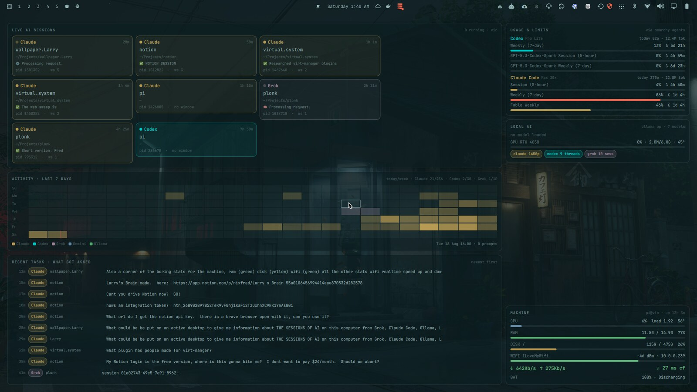
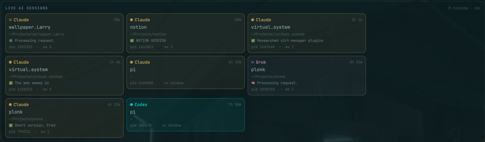
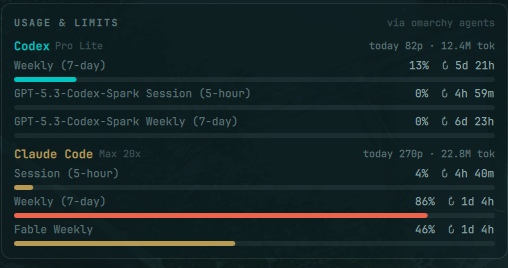
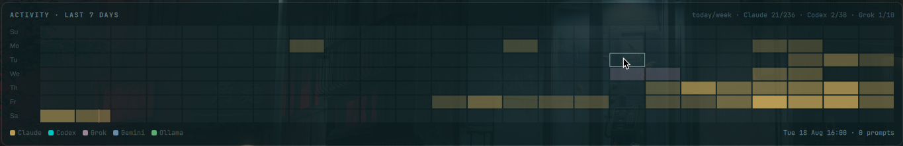
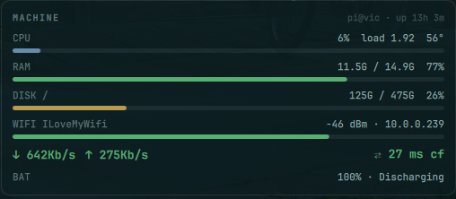

<h1 align="center">Infomarchy</h1>

<p align="center">
  <b>Your wallpaper, promoted to information desk.</b><br>
  Every AI agent running on your machine, what it's doing, what it cost you, and how the box is holding up —<br>
  drawn live on the Omarchy desktop in your current theme, one glance away, one click to jump in.
</p>

<p align="center">
  <a href="https://omarchy.org"></a>
  
  
  
  <a href="LICENSE"></a>
</p>

<p align="center">
  
</p>

---

## Why

You run Claude Code in three terminals, Codex in a fourth, Grok is poking at a repo somewhere, Ollama is warming a model, and your weekly limit is quietly at 86%. The only way to know any of that is to go *look* — tab through windows, read titles, run `nvidia-smi`, open a dashboard.

Infomarchy puts all of it on the one surface you always have open and never use: **the wallpaper.** It's not a widget in the bar and not another window to manage. It's the desk itself, and it's always current.

## What you get

<table>
<tr>
<td width="62%" valign="top">

### 🟡 Live AI sessions — *who is working right now*



One card per running agent — **Claude Code, Codex, Grok, Gemini, opencode, aider, Ollama chats** — detected straight from `/proc`, no agent-side hooks, nothing to configure. Each card shows the project, working directory, how long it's been up, the pid, the workspace it lives on, and the terminal's own title (so you read *"✅ Researched virt-manager plugins"* or *"⚙️ Processing request."* without switching to it). The dot **pulses while the agent is thinking**.

**Click a card → Infomarchy focuses the terminal window hosting that agent.** It walks the process tree up to the Hyprland client, so it works through `kitty`, `alacritty`, `ghostty`, tmux, whatever.

</td>
<td width="38%" valign="top">

### 🟢 Usage & limits — *what it's costing you*



Session (5-hour) and weekly (7-day) rate-limit meters with time-to-reset, today's prompt count and token volume, per subscription. Meters turn **yellow past 60%** and **red past 85%**, in your theme's yellow and red.

Infomarchy reuses the cache that Omarchy's own `omarchy.agents` bar widget maintains — enable that widget once and this card lights up. No extra logins, no API keys.

### 🟢 Local AI

Ollama up/down, every **loaded** model with its VRAM, GPU utilisation / memory / temperature, and lifetime totals per provider.

</td>
</tr>
</table>

### 🟡 Activity · last 7 days — *when you actually work*



An hour-by-hour heatmap of prompts across **every** provider, newest day at the bottom, with a red tick at *now*. The dominant provider colours each cell; intensity is volume. Hover a cell for the exact breakdown (*"Tue 18 Aug 16:00 · 8 prompts (Claude 6, Codex 2)"*). The header carries today/week counts per provider.

### ⚪ Recent tasks — *what got asked*

The newest prompts across all providers — time ago, provider tag, project, and the prompt itself — so the question *"what was I doing an hour ago?"* has an answer on the wall.

### 🟢🟡🔵 Machine — *the boring numbers, in the corner where they belong*



| Meter | Colour | Detail |
|---|---|---|
| **CPU** | theme blue | % busy, 1-min load, hottest thermal zone |
| **RAM** | theme **green** | used / total, % |
| **Disk** | theme **yellow** | used / total per mount (btrfs subvolume twins collapsed) |
| **Wi-Fi** | theme **green** | SSID, signal in dBm (bar = link quality), IPv4 |
| **↓ ↑ throughput** | green | **real-time** bytes/s on the default route interface, wired or wireless |
| **⇄ latency** | green / yellow / red | live **ping to Cloudflare 1.1.1.1** — red on timeout |
| **Battery** | — | % and charging state, hidden on desktops |

Any meter goes **red** when it's genuinely in trouble (RAM > 90%, disk > 90%, CPU > 85%, ping dead).

### ⌨️ Two surfaces, one dashboard

The wallpaper is interactive wherever no window covers it (right-click the empty desk still opens Omarchy's wallpaper switcher). When you're buried in terminals, **`SUPER + D`** summons the *same* dashboard as a fullscreen overlay on top of everything; `Esc` or a click on the backdrop dismisses it.

## Install

```bash
omarchy plugin add https://github.com/nixfred/infomarchy.git --enable --yes
omarchy-restart-shell    # first time only: services load at shell start
```

The plugin declares itself as a clone of `omarchy.background`, so Omarchy hands it the wallpaper role. Your chosen wallpaper is still there — dimmed to 32% behind the glass — and `omarchy theme bg set …` keeps working.

Bind the overlay in `~/.config/hypr/bindings.lua` (pick any free chord):

```lua
o.bind("SUPER + D", "Infomarchy: AI info desk", "omarchy-shell shell toggle nixfred.infomarchy '{}'")
```

<details>
<summary>Manual install</summary>

```bash
git clone https://github.com/nixfred/infomarchy.git ~/.config/omarchy/plugins/nixfred.infomarchy
omarchy-shell shell rescanPlugins
omarchy plugin enable nixfred.infomarchy
omarchy-restart-shell
```
</details>

<details>
<summary>Uninstall / go back to a plain wallpaper</summary>

```bash
omarchy plugin remove nixfred.infomarchy    # Omarchy switches back to omarchy.background
omarchy-restart-shell
```
</details>

**Requirements:** Omarchy 3.x shell (Quickshell ≥ 0.2), `bun` (ships with Omarchy), `iw`, `iproute2`, `ping`. Optional: `nvidia-smi` (GPU row hides without it), the `omarchy.agents` bar widget (for the usage card), Ollama (for the local-AI card). Hyprland 0.56+ (Lua dispatch) and older (`focuswindow`) are both handled.

## It follows your theme

There are no colours in this plugin. Infomarchy reads the active theme's `colors.toml` — `green`, `yellow`, `red`, `blue`, `cyan`, `magenta`, `foreground`, `background` — and falls back to Omarchy's `Color` singleton for anything a theme leaves out. Fonts and spacing come from Omarchy's `Style`, so `omarchy display text size` scales the desk too. Switch themes and the desk re-skins in place.

The screenshots above are the **Last Call** theme. A theme gallery is on the roadmap — PRs with your theme's screenshot are very welcome.

## How it works

```
┌──────────────────────────────┐      every 4 s       ┌────────────────────────────────────┐
│ collector.ts  (bun, ~0.2 s)  │ ───── JSON ────────▶ │ InfoModel.qml                      │
│  /proc  /sys  hyprctl        │                      │  runs collector · parses snapshot  │
│  ~/.claude/history.jsonl     │                      │  reads theme colors.toml           │
│  ~/.codex/*.jsonl            │                      └──────────────┬─────────────────────┘
│  ~/.grok/active_sessions.json│                                     │ desk: InfoModel
│  Ollama /api/ps /api/tags    │               ┌─────────────────────┴───────────────────┐
│  omarchy agents usage cache  │               │ InfoView.qml  (cards, heatmap, meters)  │
│  iw · ip · ping · nvidia-smi │               └───────┬───────────────────────┬─────────┘
└──────────────────────────────┘                       │                       │
                                     Infomarchy.qml ◀──┘                       └──▶ Overlay.qml
                                     service · WlrLayer.Background                 overlay · SUPER+D
                                     (clonedFrom omarchy.background)               WlrLayer.Overlay
```

- **`collector.ts`** builds one snapshot. It reads `argv` for every pid (cheap), then lazily `stat`s only agent processes and their ancestors, so a 1 000-process box costs ~0.2 s warm. Throughput and CPU % come from deltas against the previous run (`$XDG_STATE_HOME/infomarchy/prev.json`). It never parses the multi-hundred-MB Claude/Codex session transcripts — only the small history/index files.
- **`InfoModel.qml`** owns the timer, the parse, the theme colours, and helpers (`focusWindow`, formatting).
- **`InfoView.qml`** is pure presentation, hosted twice: on the **background** layer by `Infomarchy.qml`, and on the **overlay** layer by `Overlay.qml`. The background host keeps the `background` IPC target so Omarchy's wallpaper tooling is unaffected.

### Portable by design

No usernames, hostnames or absolute paths are hardcoded anywhere. The collector honours `HOME`, `XDG_STATE_HOME`, `CLAUDE_CONFIG_DIR`, `CODEX_HOME` and `OLLAMA_HOST`; every source is optional and degrades to "not present" rather than failing. If you don't use Grok, the Grok tag just never appears.

## Tuning

```bash
omarchy-shell shell call nixfred.infomarchy refresh                   # refresh now
quickshell ipc -p /usr/share/omarchy/shell call infomarchy setWallpaperOpacity 0.5   # 0 = solid theme bg
```

| Knob | Where | Default |
|---|---|---|
| poll interval | `refreshMs` in `Infomarchy.qml` / `Overlay.qml` | 4000 / 3000 ms |
| wallpaper dim | `wallpaperOpacity` in `Infomarchy.qml` | 0.32 |
| space left for the bar | `topInset` in `InfoView.qml` | 40 px × font scale |
| provider colours | `providerColor()` in `InfoModel.qml` | theme ANSI roles |
| add a provider | one regex in `PROVIDERS` in `collector.ts` | — |

## Privacy

Everything stays on the machine — there is no network call except the ping to `1.1.1.1` and the local Ollama API. The **Recent tasks** card shows the text of your own recent prompts on your own desktop; if you screen-share, summon something over it or comment out that card in `InfoView.qml`.

## FAQ

**Does it drain my battery?** One `bun` run every 4 s (~0.2 s of CPU warm), no idle animation except the busy-dot pulse — a few percent of one core at most. Raise `refreshMs` if you want it lower.

**The desk is black / empty.** You changed QML and the shell didn't reload the service — run `omarchy-restart-shell`. (`collector.ts` changes are picked up live.)

**Clicking a card doesn't focus anything.** The card says *no window* — the agent isn't under a Hyprland client (SSH session, systemd service, or started from a launcher that already exited). That's expected.

**Can I keep the stock wallpaper behaviour too?** Yes: disable `nixfred.infomarchy` and Omarchy restores `omarchy.background`. Or keep it enabled and set `wallpaperOpacity` to taste.

**Two monitors?** One desk per screen, each sized to its own resolution.

## Roadmap

- [ ] Per-card show/hide in the plugin settings schema (no QML editing)
- [ ] Task board from Claude Code `TaskCreate` / Codex goals, with completed-task history
- [ ] Fleet row: other hosts' AI load over SSH/Tailscale
- [ ] Memory / vector-store growth sparkline (qdrant, LMF, …)
- [ ] Theme gallery in this README — send yours

## Contributing

Issues and PRs welcome. The one rule: **nothing machine-specific** — if it needs your username, your path or your hostname, it needs to come from an env var or `/proc`. Adding a provider is a regex in `collector.ts` plus a colour/label in `InfoModel.qml`; please include a redacted sample of the data you're reading.

## Credits

Built on the [Omarchy](https://omarchy.org) shell by DHH and contributors, [Quickshell](https://quickshell.org), and [Hyprland](https://hyprland.org). The usage card stands on the shoulders of Omarchy's `omarchy.agents` widget.

Made by [Fred Nix](https://github.com/nixfred) with Larry, Atlanta, 2026.

## License

[MIT](LICENSE)
