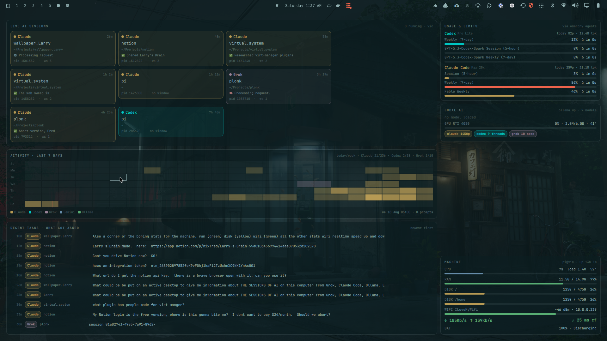

# Desk — your wallpaper, but it tells you what the AI is doing

An [Omarchy](https://omarchy.org) shell plugin that replaces the static
wallpaper with a **live, clickable AI control room**, plus a corner of the
boring machine stats. Everything is drawn from the active Omarchy theme, so it
restyles itself when you switch themes.



## What's on it

| Card | Shows | Click |
|------|-------|-------|
| **Live AI sessions** | every running Claude Code / Codex / Grok / Gemini / opencode / aider / Ollama chat: project, cwd, uptime, terminal title (busy pulse while it's thinking), pid, workspace | focuses the terminal window hosting that agent |
| **Activity · last 7 days** | hour-by-hour heatmap of prompts across all providers (dominant provider colors the cell), red tick = now | hover a cell for the breakdown |
| **Recent tasks** | newest prompts across providers, with project | scrollable |
| **Usage & limits** | session / weekly rate-limit meters and today's prompts+tokens — reuses the cache of Omarchy's own `omarchy.agents` bar widget (enable it once) | |
| **Local AI** | Ollama up/down, loaded models + VRAM, GPU util/mem/temp, per-provider totals | |
| **Machine** | CPU % + load + temp (blue), **RAM (green)**, **disk (yellow)**, **Wi-Fi (green)** SSID + dBm + IP, **live ↓/↑ throughput**, **ping to Cloudflare 1.1.1.1**, battery | |

`SUPER + D` (if you bind it, see below) summons the same dashboard as a
fullscreen overlay over your windows; `Esc` or click outside closes it.
Right-click on the empty desk opens Omarchy's wallpaper switcher, like stock.

## Install

```bash
omarchy plugin add https://github.com/nixfred/desk.git --enable --yes
```

or by hand:

```bash
git clone https://github.com/nixfred/desk.git ~/.config/omarchy/plugins/nixfred.desk
omarchy-shell shell rescanPlugins
omarchy plugin enable nixfred.desk
omarchy-restart-shell   # first time only — services load at shell start
```

Optional keybinding (`~/.config/hypr/bindings.lua`):

```lua
o.bind("SUPER + D", "Desk: AI control room", "omarchy-shell shell toggle nixfred.desk '{}'")
```

Requirements: Omarchy 3.x shell (Quickshell), `bun` (ships with Omarchy),
`iw`, `ping`, `ip`. `nvidia-smi` is optional (GPU card hides without it).

## How it works

- `manifest.json` declares `omarchy.clonedFrom: "omarchy.background"`, so the
  shell routes the wallpaper role to Desk and `omarchy-theme-bg-set` keeps
  working (the chosen wallpaper is shown dimmed behind the glass cards).
- `collector.ts` (bun) builds one JSON snapshot every few seconds from `/proc`,
  `/sys`, `hyprctl clients -j`, `~/.claude/history.jsonl`, `~/.codex/`,
  `~/.grok/`, the Ollama API and Omarchy's agents usage cache. It is
  incremental-cheap (~0.2 s) and never parses the big session transcripts.
- `DeskModel.qml` runs the collector on a timer and reads the theme's
  `colors.toml` for the ANSI roles (`green`, `yellow`, `red`, `blue`, …),
  falling back to Omarchy's `Color.*` singleton.
- `Desk.qml` hosts the view on the Wayland **background** layer;
  `Overlay.qml` hosts the same view on the **overlay** layer when summoned.

No usernames, hostnames, or absolute paths are hardcoded. `HOME`, `XDG_STATE_HOME`,
`CLAUDE_CONFIG_DIR`, `CODEX_HOME` and `OLLAMA_HOST` are honored.

## Tuning

```bash
omarchy-shell shell call nixfred.desk refresh                 # force a refresh
quickshell ipc -p /usr/share/omarchy/shell call desk setWallpaperOpacity 0.5
```

Edit `refreshMs` in `Desk.qml` to change the poll rate (default 4 s).

## Privacy note

The "Recent tasks" card shows the text of your recent prompts on your own
desktop. If you screen-share, summon something on top of it — or set
`refreshMs` high and drop the card. It never leaves the machine.

## License

MIT — see [LICENSE](LICENSE).
